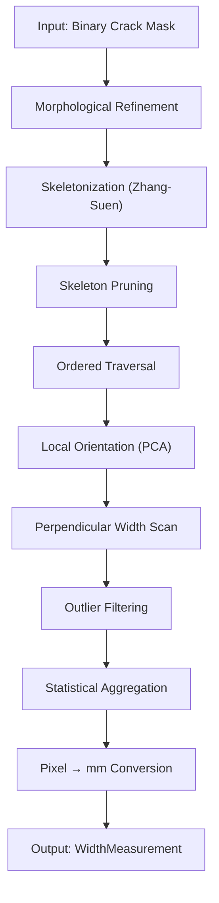
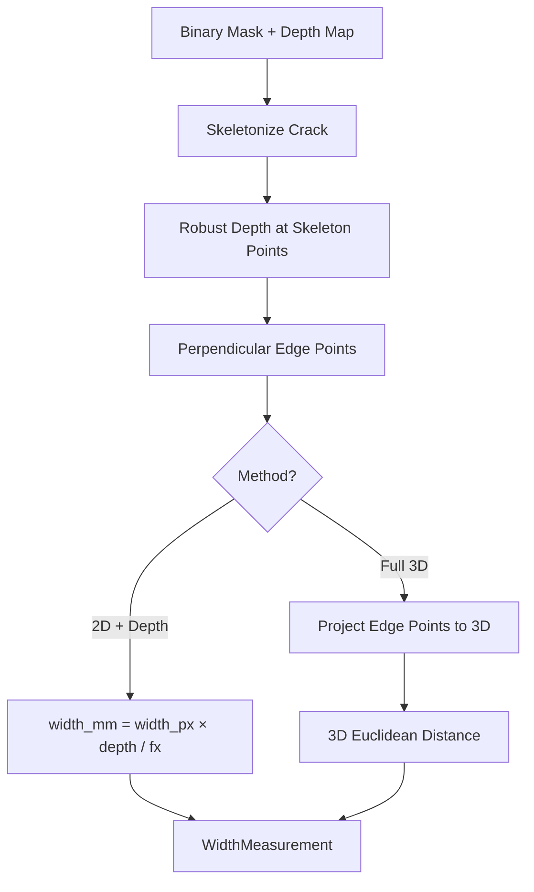

# Width Estimation Algorithms for Bridge Crack Inspection

---
title: "Width Estimation Algorithms for Bridge Crack Inspection"
author: "IDEATOR GECT — SID"
date: "2026-05-22"
geometry: margin=1in
---

### SID — Structural Inspection Drone · IDEATOR GECT

---

## 1. Introduction

Crack width is the **single most critical measurement** in structural bridge inspection. It directly determines:

- **Structural safety classification** under IS 456:2000 (Indian Standard)
- **Corrosion risk** — wider cracks expose reinforcement to moisture and chlorides
- **Maintenance priority** — width thresholds dictate whether to monitor, repair, or shut down

### IS 456:2000 Permissible Crack Widths

| Exposure Class | Permissible Width | Typical Environment |
|---|---|---|
| **Mild** | ≤ 0.30 mm | Interior, protected from weather |
| **Moderate** | ≤ 0.20 mm | Sheltered from severe rain; in contact with non-aggressive soil |
| **Severe** | ≤ 0.10 mm | Exposed to coastal environment, de-icing salts, aggressive chemicals |

> [!IMPORTANT]
> Cracks exceeding the permissible width for their exposure class are **non-compliant** and require immediate engineering assessment.

This document describes two production-ready methods implemented in SID, plus alternative approaches for reference.

---

## 2. Method 1: Monocular Camera — Skeletonization + Perpendicular Distance

### Overview

This method works with a **single camera** (no stereo, no depth sensor). It segments the crack at pixel level, extracts its medial axis (skeleton), then measures the true width perpendicular to the crack direction at every point along its length.

**Best for:** Rapid drone surveys, lightweight hardware, cost-sensitive deployments.

### Prerequisites

| Input | Description |
|---|---|
| **Binary crack mask** | Pixel-level segmentation from YOLO model (640×640 → full resolution) |
| **Scale information** | One of: drone altitude + camera specs, reference marker in image, or pre-computed GSD |

### Algorithm — Step by Step



#### Step 1: Morphological Refinement

Clean the raw segmentation mask to remove noise and bridge small gaps:

```python
# Close small gaps (dilation → erosion)
kernel_close = np.ones((3, 3), np.uint8)
mask = cv2.morphologyEx(mask, cv2.MORPH_CLOSE, kernel_close)

# Remove specks (erosion → dilation)
kernel_open = np.ones((2, 2), np.uint8)
mask = cv2.morphologyEx(mask, cv2.MORPH_OPEN, kernel_open)
```

#### Step 2: Skeletonization (Zhang-Suen Thinning)

Extract the **medial axis** — a 1-pixel-wide line running through the center of the crack:

```python
from skimage.morphology import skeletonize
skeleton = skeletonize(mask > 0)  # Boolean array
```

The skeleton preserves the topology of the crack while reducing it to a single-pixel-wide path. This is the foundation for orientation-aware width measurement.

#### Step 3: Skeleton Pruning

Raw skeletons have **spurious branches** (artifacts from rough edges). These must be removed:

```
Before pruning:          After pruning:
    /                        
---+---*****            ----*****
    \                        
```

**Algorithm:** Iteratively remove endpoint pixels (pixels with only 1 skeleton neighbor) on branches shorter than `min_branch_length` (default: 15 pixels).

#### Step 4: Ordered Skeleton Traversal

Order the skeleton pixels along the crack path using **nearest-neighbor chaining**:

1. Find an endpoint (pixel with exactly 1 skeleton neighbor)
2. Walk to the nearest unvisited skeleton pixel
3. Repeat until all skeleton pixels are visited

This produces an ordered sequence of points `(x₁, y₁), (x₂, y₂), ..., (xₙ, yₙ)` tracing the crack.

#### Step 5: Local Orientation via PCA

At each sample point along the skeleton, compute the **local crack direction**:

1. Take a window of `W` skeleton points centered on the current point (default W = 15)
2. Apply **Principal Component Analysis (PCA)** to the window coordinates
3. The first principal component gives the crack direction vector
4. The crack angle: `θ = atan2(eigenvector₁.y, eigenvector₁.x)`

```python
from numpy.linalg import eigh

# Points in window
window = skeleton_points[max(0, i-W//2) : i+W//2+1]
centroid = np.mean(window, axis=0)
centered = window - centroid

# Covariance matrix
cov = centered.T @ centered
eigenvalues, eigenvectors = eigh(cov)

# Crack direction = eigenvector with largest eigenvalue
crack_direction = eigenvectors[:, -1]
theta = np.arctan2(crack_direction[1], crack_direction[0])
```

#### Step 6: Perpendicular Width Measurement

At each sample point (every `sample_spacing` = 3 pixels along the skeleton):

1. Compute the **perpendicular direction**: `θ_perp = θ + π/2`
2. **Cast rays** in both perpendicular directions (+/-)
3. Walk pixel-by-pixel along each ray until exiting the crack mask
4. Record the **edge crossing points** (last pixel inside the mask)
5. **Width** = Euclidean distance between the two edge crossings

```
         ← ray_left ←  [skeleton point]  → ray_right →
         ·····•--------*---------•·····
              ↑                   ↑
         edge_left           edge_right
         
         width = distance(edge_left, edge_right)
```

```python
# Perpendicular direction
perp_x = -math.sin(theta)
perp_y = math.cos(theta)

# Cast ray in positive direction
edge_pos = cast_ray(point, (+perp_x, +perp_y), mask, max_dist=200)
# Cast ray in negative direction
edge_neg = cast_ray(point, (-perp_x, -perp_y), mask, max_dist=200)

if edge_pos and edge_neg:
    width = math.hypot(edge_pos[0]-edge_neg[0], edge_pos[1]-edge_neg[1])
```

#### Step 7: Outlier Filtering

Remove erroneous measurements (at branch junctions, endpoints, etc.):

- Discard measurements where `width > 3 × median_width`
- Discard measurements where `width < 1 pixel`

#### Step 8: Statistical Aggregation

From the filtered width measurements:

| Statistic | Description |
|---|---|
| `mean_width_px` | Arithmetic mean |
| `median_width_px` | 50th percentile — most representative |
| `max_width_px` | Maximum crack opening |
| `min_width_px` | Minimum crack opening |
| `std_width_px` | Standard deviation |
| `percentile_95_width_px` | 95th percentile — near-worst case |

> [!TIP]
> **Use `median_width_px`** as the primary reported width. It is robust to outliers at branch points and endpoints. Use `max_width_px` for worst-case structural assessment.

#### Step 9: Pixel-to-Millimeter Conversion

Convert pixel widths to physical units using the **Ground Sample Distance (GSD)**:

$$
\text{GSD} = \frac{H \times S_w}{f \times W_{img}}
$$

Where:
- `H` = altitude (distance camera → surface) in mm
- `S_w` = camera sensor width in mm
- `f` = focal length in mm
- `W_img` = image width in pixels

Then:

$$
\text{width\_mm} = \text{width\_px} \times \text{GSD}
$$

**Example:** DJI Mavic 3E at 5m altitude:
- Sensor: 17.3 mm, Focal length: 12.29 mm, Image width: 5280 px
- GSD = (5000 × 17.3) / (12.29 × 5280) = **1.33 mm/px**
- A 3-pixel crack = 3 × 1.33 = **3.99 mm**

### Accuracy Characteristics

| Condition | Expected Accuracy |
|---|---|
| Straight crack, ≥ 5 px wide | ± 1 px (± 1 × GSD mm) |
| Curved crack | ± 1.5 px |
| Very thin crack (1-2 px) | ± 1 px (limited by resolution) |
| Branching crack | ± 2 px at junctions |

### Limitations

- **Cannot measure cracks thinner than 1 pixel** — increase resolution or reduce altitude
- **GSD accuracy depends on altitude measurement accuracy** — use barometer + IMU for best results
- **No depth information** — assumes flat surface perpendicular to camera

---

## 3. Method 2: Stereo Camera — ZED2 Depth-Based Measurement

### Overview

Uses a **stereo camera** (ZED 2) to obtain a per-pixel depth map. This eliminates the need for altitude-based GSD calculation — depth is measured directly.

**Best for:** High-accuracy inspections, close-range surveys, variable-distance scenarios.

### Prerequisites

| Input | Description |
|---|---|
| **Binary crack mask** | Same as monocular |
| **Depth map** | Per-pixel depth from ZED SDK (float32, mm) |
| **Camera intrinsic matrix** | `fx, fy, cx, cy` from ZED calibration |

### Algorithm



#### 2D + Depth Method (Simpler)

1. Measure perpendicular pixel width (identical to monocular)
2. Get robust depth at crack location: **median** depth in 5×5 window, ignoring NaN/0
3. Convert:

$$
\text{width\_mm} = \text{width\_px} \times \frac{Z}{f_x}
$$

Where `Z` = depth in mm, `f_x` = focal length in pixels.

#### Full 3D Method (More Accurate)

1. Find perpendicular edge point pairs (same as monocular)
2. For each edge pixel `(u, v)` with depth `Z`:

$$
X = \frac{(u - c_x) \times Z}{f_x}, \quad Y = \frac{(v - c_y) \times Z}{f_y}
$$

3. Compute true 3D Euclidean distance:

$$
\text{width\_3d} = \sqrt{(X_1 - X_2)^2 + (Y_1 - Y_2)^2 + (Z_1 - Z_2)^2}
$$

This handles **non-planar surfaces** (curved beams, piers) where monocular would fail.

### Accuracy Characteristics

| Condition | Expected Accuracy |
|---|---|
| ZED 2 at 1 m distance | ± 0.5 mm |
| ZED 2 at 3 m distance | ± 2 mm |
| ZED 2 at 5 m distance | ± 5 mm |
| Non-planar surfaces | Significantly better than monocular |

### Advantages over Monocular

- ✅ **No calibration markers needed** — depth is directly measured
- ✅ **Works on non-planar surfaces** — 3D projection handles curvature
- ✅ **No altitude dependency** — independent of flight controller accuracy
- ✅ **Per-pixel depth** — variable distance across the image handled automatically

### Limitations

- ❌ **Heavier payload** — ZED 2 weighs ~124g + USB 3.0 connection
- ❌ **Limited range** — stereo accuracy degrades beyond ~10m
- ❌ **Cost** — ZED 2 costs ~$449 vs ~$0 for monocular on existing drones
- ❌ **Depth noise** — noisy in featureless regions (uniform concrete)

---

## 4. Alternative Approaches

### 4.1 LiDAR-Based Measurement

**How it works:** A LiDAR scanner creates a 3D point cloud of the bridge surface. Cracks appear as discontinuities or depth changes in the point cloud.

| Aspect | Details |
|---|---|
| **Accuracy** | ± 0.2 mm at close range |
| **Cost** | $5,000 – $50,000+ |
| **Weight** | 200g – 2 kg |
| **Best for** | High-value infrastructure, detailed 3D modeling |

**Limitations:** Cannot detect surface cracks that don't create depth changes (hairline cracks). High cost and weight.

### 4.2 Photogrammetry / Structure-from-Motion (SfM)

**How it works:** Multiple overlapping images are processed to create a 3D point cloud and orthomosaic. Crack width is measured on the orthorectified image using known GSD.

| Aspect | Details |
|---|---|
| **Accuracy** | ± 1-2 mm (depends on GSD) |
| **Cost** | Software only (Agisoft, OpenDroneMap) |
| **Weight** | Standard drone camera |
| **Best for** | Large-area surveys, documentation |

**Limitations:** Computationally expensive (hours to process). Accuracy limited by GSD. Requires significant overlap (70-80%).

### 4.3 Laser Projection Calibration

**How it works:** A laser projects a line or grid of known dimensions onto the surface. The image captures both the laser reference and the crack, enabling precise scale calibration.

| Aspect | Details |
|---|---|
| **Accuracy** | ± 0.1 mm |
| **Cost** | $50 – $500 for laser module |
| **Weight** | 20 – 100g |
| **Best for** | Close-range, high-precision measurement |

**Limitations:** Requires custom hardware integration. Line-of-sight to crack needed. One crack at a time.

### 4.4 Deep Learning Direct Regression

**How it works:** Train a neural network to directly predict crack width from the image patch — no intermediate segmentation or skeletonization.

| Aspect | Details |
|---|---|
| **Accuracy** | ± 0.5 – 2 mm (model dependent) |
| **Cost** | Training compute + labeled dataset |
| **Weight** | Standard camera |
| **Best for** | Real-time applications, edge deployment |

**Limitations:** Requires large labeled dataset with ground-truth widths. Black-box (no interpretable measurement points). Generalization to new environments is uncertain.

---

## 5. Method Comparison

| Criterion | Monocular + Skeletonization | Stereo Camera (ZED2) | LiDAR | Photogrammetry | Laser Projection | DL Regression |
|---|---|---|---|---|---|---|
| **Accuracy** | ± 1 px × GSD | ± 0.5–5 mm | ± 0.2 mm | ± 1–2 mm | ± 0.1 mm | ± 0.5–2 mm |
| **Hardware Cost** | $0 (existing camera) | ~$450 | $5K–$50K | $0 | ~$200 | $0 |
| **Weight Added** | 0 g | ~124 g | 200g–2kg | 0 g | ~50 g | 0 g |
| **Processing Speed** | ~50 ms/image | ~80 ms/image | Minutes | Hours | ~30 ms/image | ~20 ms/image |
| **Setup Complexity** | Low | Medium | High | Medium | Medium | High (training) |
| **Works at Distance** | Yes (adjust GSD) | Up to ~10 m | Up to 100 m | Yes | Up to ~5 m | Yes |
| **Non-Planar Surfaces** | ❌ | ✅ | ✅ | ✅ | ❌ | ❌ |
| **Real-Time Capable** | ✅ | ✅ | ❌ | ❌ | ✅ | ✅ |

> [!TIP]
> **Recommended strategy:** Start with **monocular** for wide-area surveys (fast, no extra hardware). Use **stereo** for detailed follow-up inspections of flagged cracks. Use **LiDAR/photogrammetry** only for critical infrastructure requiring sub-mm accuracy.

---

## 6. Calibration Guide

### Monocular — GSD from Altitude

```python
from crack_detection.width_estimation.calibration import CameraCalibrator

calibrator = CameraCalibrator(
    focal_length_mm=12.29,    # From camera datasheet
    sensor_width_mm=17.3,     # From camera datasheet
    image_width_px=5280,      # Image resolution
)

scale = calibrator.calibrate_from_altitude(altitude_m=5.0)
# scale.gsd_mm_per_px ≈ 1.33 mm/px
```

### Monocular — Reference Marker

Place a **known-size marker** (e.g., 50mm ArUco marker) on the bridge surface:

```python
scale = calibrator.calibrate_from_reference(
    image=image,
    known_width_mm=50.0,
)
# Scale auto-detected from marker in image
```

### Stereo — ZED2

```python
from crack_detection.width_estimation.stereo import StereoWidthEstimator

# ZED SDK provides camera matrix and depth map
estimator = StereoWidthEstimator(camera_matrix=zed_intrinsics)
result = estimator.estimate_width_3d(mask, depth_map, camera_matrix=zed_intrinsics)
```

---

## 7. IS 456:2000 Quick Reference

### Permissible Crack Widths (Table 35)

| Exposure | Condition | Max Crack Width |
|---|---|---|
| **Mild** | Concrete fully protected against weather, aggressive conditions | 0.30 mm |
| **Moderate** | Concrete sheltered from severe rain; in contact with non-aggressive soil/water | 0.20 mm |
| **Severe** | Concrete exposed to severe rain, coastal environment, de-icing salts | 0.10 mm |

### Severity Classification in SID

| Level | Crack Width | Action |
|---|---|---|
| **MINOR** | < 0.10 mm | Monitor during next inspection cycle |
| **MODERATE** | < permissible limit | Schedule epoxy injection within 6 months |
| **SEVERE** | < 2× permissible limit | Urgent repair — structural epoxy injection or patch |
| **CRITICAL** | ≥ 2× permissible limit | **IMMEDIATE** — structural assessment + emergency repair |

---

## 8. References

1. IS 456:2000 — Indian Standard Plain and Reinforced Concrete - Code of Practice (Fourth Revision)
2. Zhang, T.Y. & Suen, C.Y. (1984) — "A fast parallel algorithm for thinning digital patterns"
3. Stereolabs ZED 2 Technical Specifications — https://www.stereolabs.com/zed-2
4. Real-ESRGAN Super-Resolution — https://github.com/xinntao/Real-ESRGAN
5. Ultralytics YOLOv11 — https://docs.ultralytics.com

---

*IDEATOR GECT · Centre for Innovation · Government Engineering College Thrissur*
